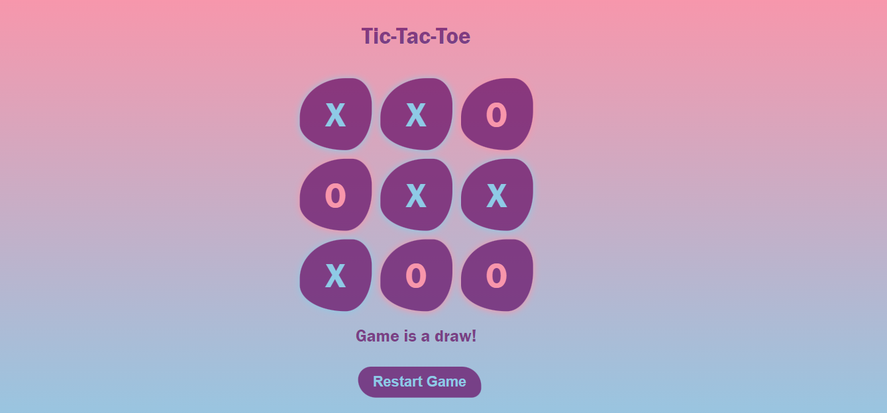

<!DOCTYPE html>
<html lang="en">
<body>
  <h1>Tic-Tac-Toe Task-03</h1>
  
This project based on Task-03 Tic-Tac-Toe game by Ahmed bilal
  This is a simple Tic-Tac-Toe game implemented using HTML, CSS, and JavaScript. The game features a pop-up box that displays the winner with an animation and includes options to close the pop-up or restart the game.

  
  <h2>Features</h2>
  <ul>
      <li>Responsive design with blob</li>
      <li>Interactive game board</li>
      <li>Animated pop-up box for game results ,restart game functionality</li>
 </ul>

 
  <h2>Language and Tools</h2>
  
Build with  HTML ,CSS and JavaScript. 

  <h2>Preview Images</h2>

  
Here are previews of the StopWatch on various screen sizes:

  <figure>
    <figcaption><b>Desktop Preview</b></figcaption>
    
  </figure>
  <figure>
      <figcaption><b>Tablet Preview</b></figcaption>
    
  </figure>
  <figure>
      <figcaption><b>Mobile Preview</b></figcaption>
    
  </figure>

  live at : https://iahmedbilal.github.io/Tic-Tac-toe-game/

  
</body>
</html>
